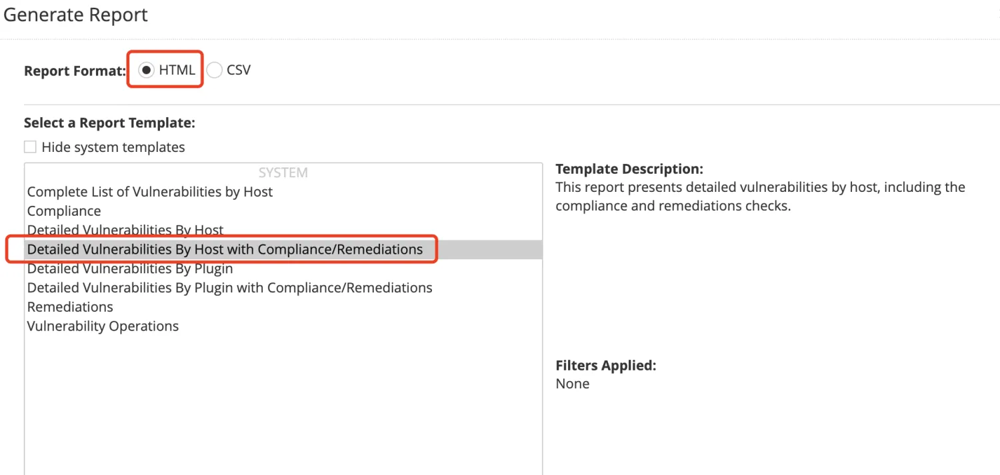

# Nessus_to_csv
由项目：https://github.com/Bypass007/Nessus_to_report 进行二次维护修改的nessus报告（html）转中文csv的脚本

## 使用前提

<ul>
<li>作者测试环境为python3.9，若想开箱即用直接使用python3.9版本</li>
<li>Nessus导出的报告格式为html格式，可参考如下图</li>
</ul>

## 使用方法
**单个文件生成**

`python3 Nessus_report.py 文件名.html`

运行该命令后会生成一个文件名.html.csv的格式文件在同文件夹下

**批量生成**

如果出现下图所示的情况，有多个html文件需要进行csv转换，使用以下的bash脚本的可以进行批量html转换成csv

**！！！作者所使用的环境为mac环境，如需直接使用可配置好run.sh中的python路径以及文件夹路径在linux环境中使用，若在windows环境中需使用bat脚本来批量完成如下所示命令**
`python3 Nessus_report.py 文件名.html`
